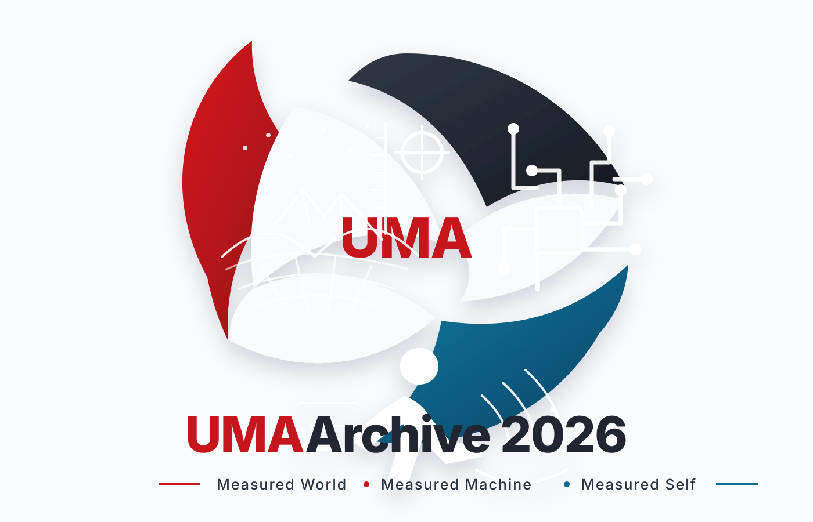

# UMA Archive 2026 Branding

This folder contains visual identity assets for the UMA Archive 2026 repository.

## Current logo

## Meaning

The mark is organized around the three-part UMA identity:

- **Measured World** — physical measurement, landscape, scale, distance, and the visible world.
- **Measured Machine** — circuitry, controllers, firmware, dashboards, and machine reasoning.
- **Measured Self** — human motion, rhythm, support, and agency.

The three parts form one loop to emphasize that the archive is not a collection of disconnected gadgets. It is one learning architecture.

## Recommended uses

- GitHub README header.
- Documentation covers.
- Project inventory front matter.
- Slide title pages.
- Comic/storyboard title pages.

## Source note

This SVG is a clean repo-safe vector version based on the generated UMA Archive 2026 logo concept.
